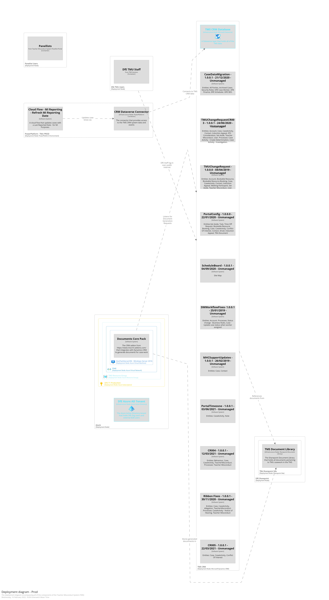

# Teacher Misconduct System Architecture

## Overview

The Teacher Misconduct System is based on Microsoft Dynamics 365, with a document generation VM hosted in Tier 1 Azure.  Documents generated with this system are stored in the main DfE Sharepoint deployment.

There are extensive customisations deployed into the CRM system as CRM Solutions, and these include the entities, processes and workflows that make up the system.

## Production Architecture Diagram

# Panellist Poral
The Panelist Portal is a web application that TMU Panellists log in to in order to conduct their role.  This portal is a CRM hosted portal, and is accessed via the public internet.

# Document Storage
Documents relating to cases in the TMS are stored in sharepoint.  The main DfE sharepoint deployment contains a site that holds all documents relating to the production environment of the TMS.

# Document Core Pack Server
This is a Windows 2016 Virtual Machine that is supported internally at the DfE.  This server holds the document templates that are used in the document generation process.

# Power Platform - Cloud Flows
There is a single cloud flow that operates on TMS data, and that flow appears to update a date column in each case record.

## Other environments

There are three software environments for the TMS system:
* PROD
* PRE-PROD
* DEV

The PROD environment has been documented as above, but the PRE-PROD and DEV environments do not have parity with the PROD environment.
Both PRE-PROD and DEV do not have a Document Pack Server - there is only one instance of this server across all of the environments.
Also, the number of solutions and their status differs between environments.

