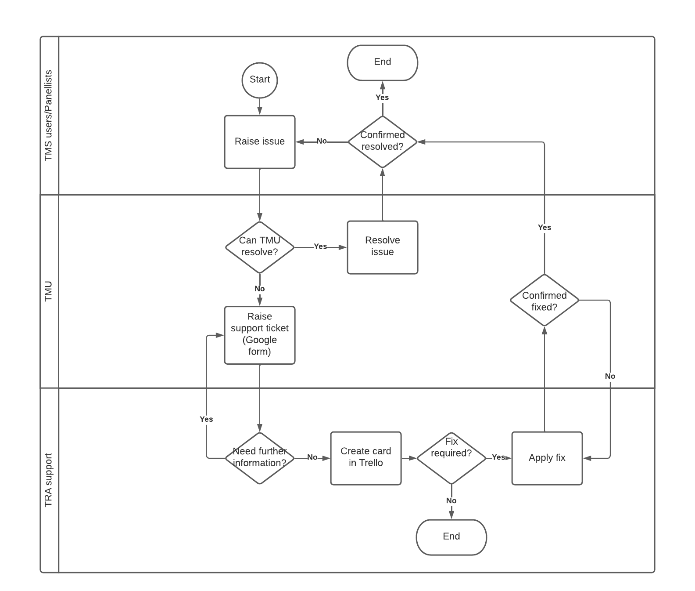

# TMS user support process (as of February 2022)

## TMS support

Support is provided to the following users:

- TMS users (case managers, case workers, admin, scheduling)
- Panellists accessing the panellist portal

### TMS users

TMS users raise issues to the TMS system administrator via MS Teams, emails or face to face conversations.
The issues raised are triaged by the system TMS administrator and where possible, these issues are resolved by the TMU team.
If the issue cannot be resolved within the team, then it is raised with the TRA support team through the [TRA problem support form](https://docs.google.com/forms/d/1kZ3X_y3GkanPqqI9upQdCH8ejk5UBJ4U7hPD0OBMDt4/edit).

Once raised, the issue is picked up by the TRA CRM developer. The CRM developer creates a card in Trello for the issue and it is fixed and tracked through the [TRA Digital team board in Trello](https://trello.com/b/uV6uke2b/tra-digital-team-board).

### Panellists

Panellists raise issues in the following ways:

- Sending an email to the following inbox - <tmsportal@education.gov.uk>. The inbox is managed by one person (TMU admin staff).
- Sending an email to the Stakeholder Engagement team. The Stakeholder Engagement team consists of 2 TMU operational staff and a TMU team lead.

In both cases, if the issue cannot be resolved, it is raised with the TRA support team through the [TRA Digital team board in Trello](https://trello.com/b/uV6uke2b/tra-digital-team-board).

## Categorisation, SLAs and escalation

There are no formal issue categories or no agreed SLAs with panellists or TMS users. However, panellists are prioritised.

There are no critical TMS functions that require high priority categorisation. Whilst there are some procedural documents that are time bound, these are backed up in SharePoint and therefore can still be accessed even if the TMS system is down.

There is no formally defined escalation route. Issues are dealt with by TMU and the TRA support team.

## Volume

The volume of issues is low (approx 50 calls per year). Issues tend to slightly increase when there is a new release deployed.
There are approximately 30 TMS users (case managers, case workers, admin, scheduling).
There are approximately 110 panellists. There are roughly 150 panels a year.

## User onboarding and offboarding

TMS users are on-boarded during induction into TMU. This includes a training session and access to a TMS user guide.
To off-board, users are removed from the TMS by TMS admin staff.

## Additional information

- There is no phone line support. However, TMU staff sometimes help panellists through issues over the phone.
- Issues are typically user error. E.g. accidental deletion, lack of understanding of the system, incorrect input, cannot remember how to do things. Panellists tend not to be technically savvy so need basic support that is provided by TMU
- Usually, errors that cannot be resolved by the TMU are business process error messages.
- There are no standard responses to common issues. Each issue is responded to individually.
- No formal reporting is currently done on issues.
- There is no remote dial in support and this has never been required in the past.
- There has been a major incident in the past due to a Microsoft update. Now, the TMU has a timetable of Microsoft updates to avoid the issue occurring again. TRA digital will be responsible for ensuring that TMU are aware of any Microsoft updates that may affect the TMS.

## Process flowchart

